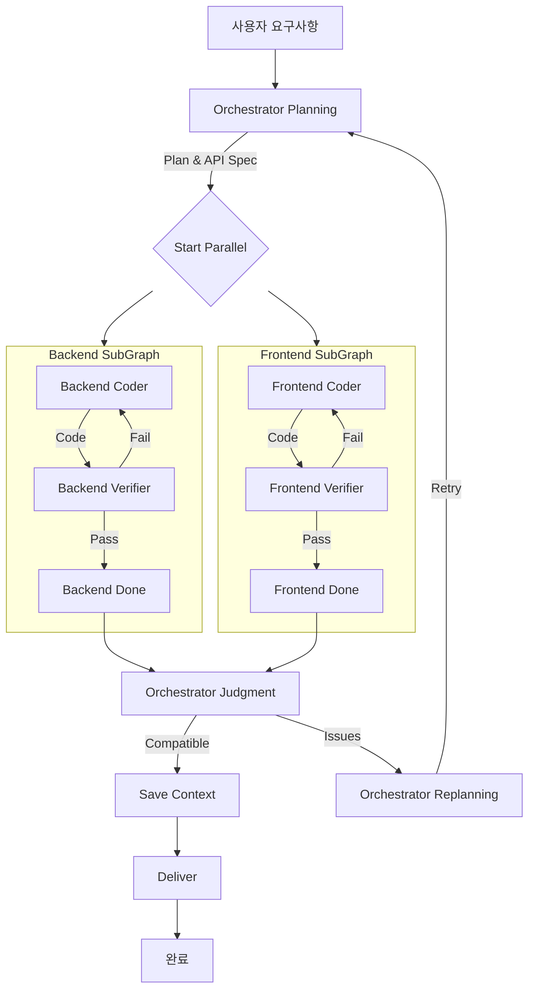

# DAACS v6.0 - Dynamic Agentic AI Coding System

> **LangGraph 기반 병렬 실행 워크플로우로 AI 에이전트가 풀스택 애플리케이션을 자동 생성합니다.**

[](https://www.python.org/downloads/)
[](https://fastapi.tiangolo.com/)
[](https://langchain-ai.github.io/langgraph/)

---

## 👥 프로젝트 팀 구성 및 역할

**📅 프로젝트 기간**: 2025.12.02(화) - 2025.12.10(수)  
**👥 참여 인원**: 이규경, 박대엽, 배유진, 현금비  


| 이름 | 역할 | 핵심 키워드 |
| --- | --- | --- |
| 🤖 이규경 | PM / 백엔드 엔지니어 | • 프로젝트 목표·범위 정의 및 우선순위 설정<br>• 프로젝트 구조 설계 |
| 🤖 박대엽 | 백엔드 엔지니어 | • LLM 및 품질 게이트(테스트, 보안 등) 연계를 통한 안정적인 자동 실행 루프 구현 |
| 🤖 배유진 | 프론트엔드 엔지니어 | • 자연어 명령 입력, 진행 상태, 코드 변경 내역을 한눈에 보여주는 DAACS UI 설계<br>• 채팅 인터페이스, 코드 뷰어, 진행 상태 표시 등 핵심 화면 프로토타입 구현 |
| 🤖 현금비 | GitHub · 일정·문서 담당 | • GitHub 저장소 구조, 브랜치 전략, 이슈·PR 프로세스 설계를 통한 작업 흐름 정리<br>• 기획서·설계서·회의록 등 주요 산출물 관리 및 일정·진행 상황 가시성 확보 |

---

## 🎯 개요

**DAACS**(Dynamic Agentic AI Coding System)는 사용자의 자연어 요구사항을 분석하여 **완전한 풀스택 애플리케이션(Backend + Frontend)**을 **자동으로 설계, 구현, 검증**하는 **지능형 멀티 에이전트 시스템**입니다.

### 핵심 특징

| 특징 | 설명 |
|------|------|
| ⚡ **병렬 실행** | LangGraph를 활용한 Backend/Frontend 동시 코드 생성 |
| 🔄 **자가 치유 (Self-Healing)** | Verifier 검증 실패 시 Coder가 자동으로 재작업 |
| 🤖 **다중 CLI 지원** | Codex, Claude Code, Gemini CLI 선택 가능 |
| 🎭 **에이전틱 모드** | CLI가 직접 파일 생성, 명령어 실행 |
| 🌐 **REST API 서버** | Nova-Canvas 프론트엔드와 연동 가능한 API 제공 |
| 📊 **실시간 로깅** | WebSocket을 통한 실시간 진행 상황 모니터링 |

---

## 📁 프로젝트 구조

```
transformers7-project-feature-backend2/
├── daacs/                          # DAACS 핵심 모듈
│   ├── daacs_api_server.py         # 🧠 REST API 서버 (두뇌)
│   ├── config_loader.py            # ⚙️ YAML 설정 로더
│   ├── llm_source_provider.py      # 🔌 LLM 소스 추상화 계층
│   │
│   ├── graph/                      # 🔀 LangGraph 워크플로우
│   │   ├── daacs_workflow.py       #    → 메인 워크플로우 정의
│   │   ├── orchestrator_nodes.py   #    → Planning, Judgment, Replanning
│   │   ├── backend_subgraph.py     #    → Backend 팀 워크플로우
│   │   ├── frontend_subgraph.py    #    → Frontend 팀 워크플로우
│   │   ├── verification.py         #    → 코드 검증 템플릿
│   │   └── replanning.py           #    → 재계획 전략
│   │
│   ├── llm/                        # ✋ CLI 실행 계층
│   │   ├── cli_executor.py         #    → Codex/Claude/Gemini 실행
│   │   └── providers.py            #    → Provider 인터페이스
│   │
│   └── models/                     # 📊 상태 정의
│       └── daacs_state.py          #    → LangGraph State + Reducer
│
├── project/                        # 생성된 프로젝트 저장소
├── logs/                           # 실행 로그
├── daacs_config.yaml               # ⚙️ 메인 설정 파일
├── run_daacs.py                    # CLI 진입점
├── requirements.txt                # Python 의존성
├── DAACS_Presentation_Detailed.md  # 📖 발표자료 (30분 분량)
└── README.md                       # 이 파일
```

---

## 🚀 빠른 시작

### 1. 환경 설정

```bash
# 가상환경 생성 및 활성화
python -m venv .venv
.venv\Scripts\activate  # Windows
# source .venv/bin/activate  # Linux/Mac

# 의존성 설치
pip install -r requirements.txt
```

### 2. CLI 도구 설치 (선택)

```bash
# Claude Code CLI
npm install -g @anthropic-ai/claude-code

# OpenAI Codex CLI
npm install -g @openai/codex

# Gemini CLI (Google)
npm install -g @anthropic-ai/gemini  # 또는 공식 설치 방법
```

### 3. 설정 파일 확인

`daacs_config.yaml`:

```yaml
# CLI Assistant 설정
cli_assistant:
  type: "claude_code"  # codex, claude_code, gemini
  timeout: 600         # 10분

# 역할별 LLM 선택
roles:
  orchestrator:
    source: "cli_assistant"
    temperature: 0.3    # 낮춰서 일관된 계획
  backend:
    source: "cli_assistant"
    temperature: 0.7    # 창의적 코드 생성
  frontend:
    source: "cli_assistant"
    temperature: 0.7

# 실행 설정
execution:
  mode: "prod"
  max_iterations: 10
  max_subgraph_iterations: 2
  parallel_execution: true
```

### 4. 환경 변수 설정 (선택)

```bash
# .env 파일 또는 환경변수로 설정
OPENAI_API_KEY=your_openai_key          # Codex
ANTHROPIC_API_KEY=your_anthropic_key    # Claude
GOOGLE_API_KEY=your_google_api_key      # Gemini
```

---

## 💻 실행 방법

### 방법 1: CLI로 직접 실행

```bash
python run_daacs.py --goal "Create a TODO app with FastAPI backend and React frontend"
```

### 방법 2: API 서버 실행

```bash
# API 서버 시작 (포트 8001)
python -m daacs.daacs_api_server
```

**API 엔드포인트:**

| 엔드포인트 | 메서드 | 설명 |
|-----------|--------|------|
| `/api/projects` | POST | 새 프로젝트 생성 |
| `/api/projects` | GET | 프로젝트 목록 |
| `/api/projects/{id}` | GET | 프로젝트 상태 |
| `/api/projects/{id}/logs` | GET | 프로젝트 로그 |
| `/api/projects/{id}/files` | GET | 생성된 파일 목록 |
| `/api/projects/{id}/run` | POST | 프로젝트 실행 |
| `/ws/projects/{id}/logs` | WS | 실시간 로그 스트리밍 |

**API 문서:** http://localhost:8001/docs

---

## 🔧 아키텍처

### 워크플로우 다이어그램



### 핵심 컴포넌트

| 컴포넌트 | 역할 |
|---------|------|
| **Orchestrator Planning** | 사용자 목표 분석, Backend/Frontend 필요 여부 결정, API 스펙 생성 |
| **Backend SubGraph** | Coder → Verifier 루프로 Python/FastAPI 코드 생성 및 검증 |
| **Frontend SubGraph** | Coder → Verifier 루프로 React/Vite 코드 생성 및 검증 |
| **Orchestrator Judgment** | Backend/Frontend API 호환성 검증 |
| **Replanning** | 실패 시 재작업 지시, 피드백 루프 |

---

## 🎭 에이전틱 모드

DAACS는 단순히 코드를 텍스트로 출력하는 것이 아니라, **실제로 파일을 생성하고 명령어를 실행**합니다.

| CLI | 실행 모드 | 특징 |
|-----|----------|------|
| **Claude** | `--dangerously-skip-permissions` | 확인 없이 파일 직접 생성 |
| **Codex** | `exec --sandbox danger-full-access` | 샌드박스 모드 실행 |
| **Gemini** | `-s` (silent mode) | 확인 스킵 |

---

## 📊 로그 및 모니터링

### 로그 파일

```
logs/
├── turns.jsonl      # 턴별 상세 로그 (JSONL)
├── workflow.jsonl   # 워크플로우 이벤트 로그
└── summary.json     # 최종 요약
```

### WebSocket 실시간 로그

```javascript
const ws = new WebSocket('ws://localhost:8001/ws/projects/{project_id}/logs');
ws.onmessage = (event) => {
  const log = JSON.parse(event.data);
  console.log(`[${log.node}] ${log.message}`);
};
```

---

## ⚠️ 주의사항

### CLI 요구사항

| CLI Type | 필요 조건 |
|----------|----------|
| `claude_code` | Claude CLI 설치 (`npm install -g @anthropic-ai/claude-code`) |
| `codex` | Codex CLI 설치 (`npm install -g @openai/codex`) |
| `gemini` | Gemini CLI 설치 |

### Codex 실행 시

- `danger-full-access` 샌드박스 모드로 실행됩니다
- 풀액세스 승인이 필요할 수 있습니다

---

## � 관련 문서

| 문서 | 설명 |
|------|------|
| [DAACS_Presentation_Detailed.md](./DAACS_Presentation_Detailed.md) | 📖 30분 발표자료 (라인별 코드 분석 포함) |
| [DAACS_Presentation.md](./DAACS_Presentation.md) | 📝 간략 발표자료 |
| [FRONTEND_DEVELOPMENT_GUIDE.md](./FRONTEND_DEVELOPMENT_GUIDE.md) | 🎨 프론트엔드 개발 가이드 |

---

## 📝 버전 히스토리

| 버전 | 날짜 | 변경 사항 |
|------|------|----------|
| **v6.0** | 2024-12 | LangGraph 기반 병렬 실행, SubGraph 아키텍처, API 서버, 에이전틱 모드 |
| v5.0 | 2024-11 | 환경 변수 기반 설정, 기본 피드백 루프 |

---

## 🚀 향후 계획

- **v6.5**: 테스트 자동 생성, 더 많은 CLI 지원
- **v7.0**: Docker 배포 자동화, CI/CD 파이프라인
- **v8.0+**: 클라우드 배포 통합, AI 코드 리뷰어

---

## 📄 라이선스

MIT License

---

**Made with ❤️ by Team S_P_**
